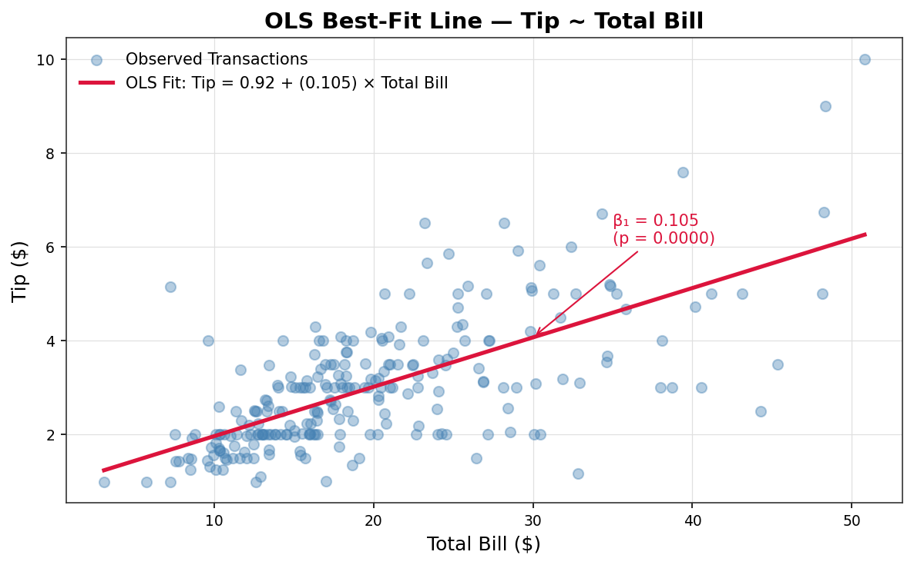
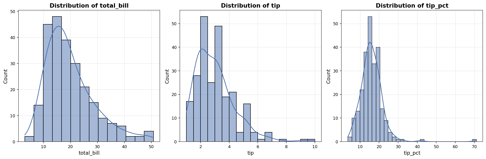
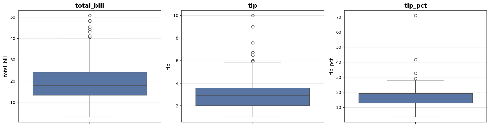
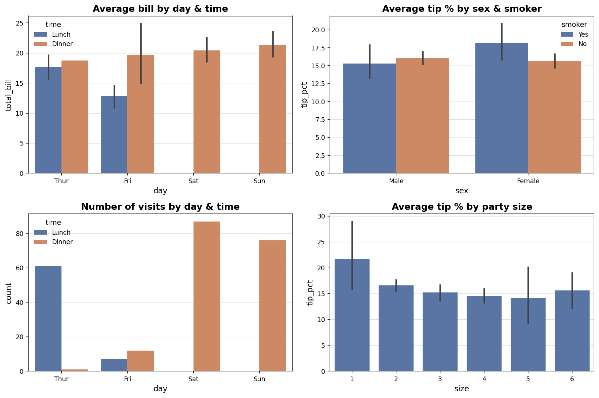
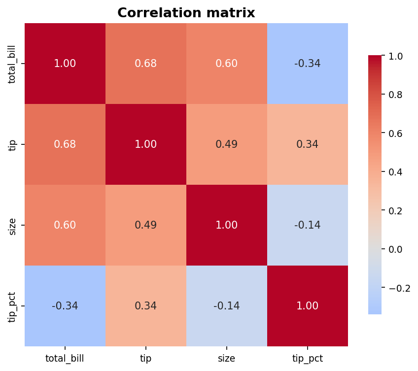
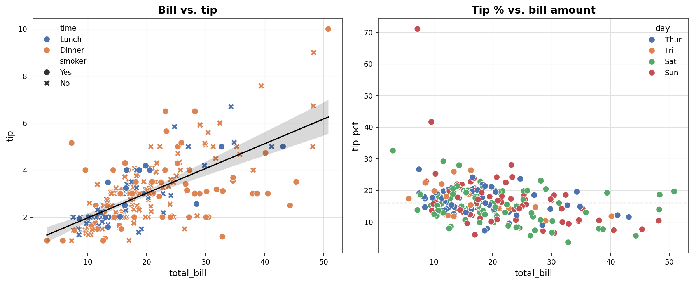
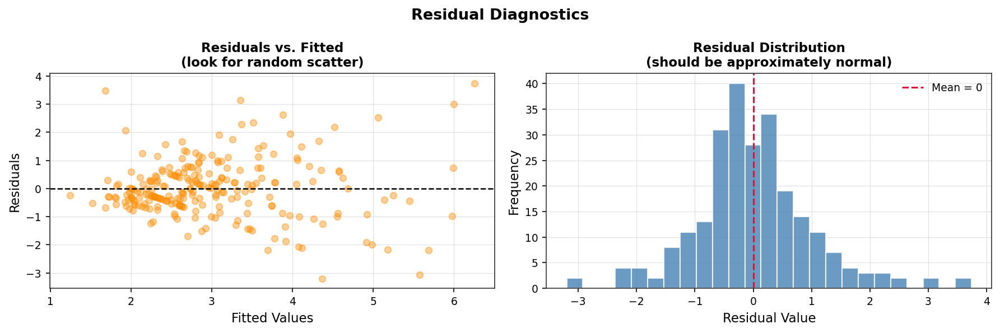

# Restaurant Tips — Statistical Analysis



Exploratory data analysis and OLS regression on 244 restaurant transactions, examining what actually drives tipping behavior — bill size, or demographic/contextual factors (sex, smoker status, day, meal time, party size).

**Data source:** `seaborn.load_dataset('tips')`
**Notebook:** [View Notebook](./notebook.ipynb)

## Key Findings

- **Bill amount is the only real driver of tip amount.** A simple linear regression of `tip ~ total_bill` explains 45.7% of the variance (R² = 0.457) and is highly significant (p < 0.001, F = 203.4). Each additional $1.00 on the bill increases the tip by about **$0.11** on average.
- **Demographic factors do not produce a real difference in tip percentage.** Sex, smoker status, day of week, and meal time show small visual differences in the charts, but statistical hypothesis testing confirms none of these are significant (p > 0.05) — likely due to chance in a small sample (244 rows).
- **Larger bills come with a slightly lower tip percentage**, even though the absolute tip amount is larger.
- **Bottom line:** the OLS model confirms numerically what the visual exploration and statistical tests already showed. The model is the last step of the analysis, not the starting point.

## Project Structure

```
├── notebook.ipynb       # Full analysis notebook
├── plots/               # All exported figures
└── README.md
```

## Analysis Workflow (`notebook.ipynb`)

| # | Section | Description |
|---|---------|-------------|
| 01 | Data Overview | Structure, types, missing values check |
| 02 | Continuous Analysis | Distributions of bill, tip, tip % |
| 03 | Outlier Analysis | Boxplots for the main numeric variables |
| 04 | Categorical Analysis | Bill/tip % by day, time, sex, smoker, party size |
| 05 | Bivariate Analysis | Correlation matrix, bill vs. tip scatter plots |
| 06 | Statistical Hypothesis Testing | Significance testing of demographic factors on tip % |
| 07 | OLS Regression | `tip ~ total_bill` model, best-fit line, residual diagnostics |
| 08 | Conclusions & Limitations | Summary of findings and caveats |

## Plots

### Distributions



Histograms (with KDE) for total bill, tip, and tip percentage. All three are right-skewed — most transactions cluster at lower values, with a tail of larger bills/tips pulling the distribution to the right.

### Outlier Check



Boxplots for the same three variables, used to flag outliers before modeling. A handful of unusually large bills and tips stand out above the upper whisker in each.

### Categorical Breakdowns



Average bill and tip % sliced by day, time, sex, smoker status, and party size. Some small visual differences appear (e.g. Sunday dinners), but the hypothesis testing in the notebook shows none of these are statistically significant.

### Correlation Matrix



Correlation heatmap across total bill, tip, party size, and tip %. Total bill and tip are strongly correlated; tip % correlates far more weakly with bill size, which is the first hint that percentage and absolute tip behave differently.

### Bivariate Relationships



Left: bill vs. tip with a fitted trend line — a clear positive relationship. Right: tip % vs. bill amount — flatter and noisier, showing that the percentage people tip doesn't scale with bill size the way the raw tip amount does.

### OLS Best-Fit Line


The fitted regression line for `tip ~ total_bill`, with the slope (β₁ = 0.105) and its p-value annotated directly on the chart. The line tracks the data closely, confirming bill size as the dominant driver of tip amount.

### Residual Diagnostics



Left: residuals vs. fitted values, used to check for non-constant variance (heteroskedasticity) — there's a mild funnel shape, meaning variance grows slightly at higher fitted values. Right: distribution of residuals — roughly centered at zero and bell-shaped, with a slight right-skew.

## Model

```
tip = 0.92 + 0.105 × total_bill
```

| Metric | Value |
|---|---|
| R² | 0.457 |
| F-statistic | 203.4 |
| p-value | 6.69e-34 |
| Coefficient (total_bill) | 0.105 (p < 0.001) |

## Limitations

- Sample size is relatively small (244 rows) — worth keeping in mind when generalizing results.
- Residuals show mild signs of heteroskedasticity and slight right-skew, visible in the residual diagnostics plot.

## How to Run

```bash
pip install pandas numpy seaborn matplotlib statsmodels scipy jupyter
jupyter notebook notebook.ipynb
```

Run all cells top to bottom (Kernel → Restart & Run All) — the dataset loads automatically via `seaborn.load_dataset('tips')`, no external file needed.

## Tools

Python · pandas · numpy · seaborn · matplotlib · statsmodels · scipy
